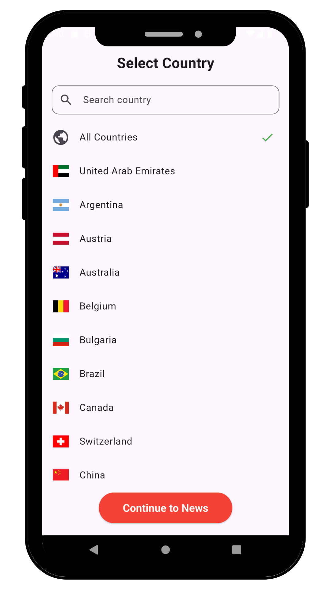

# NewsUP 📰

A modern Flutter news application that provides real-time news updates from various categories using the NewsAPI. NewsUP offers a clean, intuitive interface for browsing the latest news articles with category-based filtering and country selection.

<div align="center">
  
</div>

## ✨ Features

- **📱 Modern UI/UX**: Clean and responsive design with Material Design principles
- **🏷️ Category Filtering**: Browse news by categories including:
  - General
  - Technology
  - Science
  - Entertainment
  - Business
  - Health
  - Sports
- **🌍 Country Selection**: Choose from 50+ countries to get localized news coverage
- **🔍 Search Functionality**: Search for specific countries with real-time filtering
- **🔄 Real-time Updates**: Fetch latest news from NewsAPI
- **🖼️ Rich Content**: Display news articles with images, titles, and descriptions
- **📱 Cross-platform**: Works on Android, iOS, and Web

## 🚀 Getting Started

### Prerequisites

- Flutter SDK (version 3.7.2 or higher)
- Dart SDK
- Android Studio / VS Code
- Git

### Installation

1. **Clone the repository**
   ```bash
   git clone https://github.com/rababhamdyy/news_up.git
   cd news_up
   ```

2. **Install dependencies**
   ```bash
   flutter pub get
   ```

3. **Run the app**
   ```bash
   flutter run
   ```

## 🛠️ Technologies Used

- **Flutter**: Cross-platform UI framework
- **Dio**: HTTP client for API requests
- **NewsAPI**: News data source
- **Material Design**: UI/UX design system
- **Flag Package**: Country flag display

## 📊 API Integration

The app integrates with [NewsAPI](https://newsapi.org/) to fetch real-time news data. The service supports:

- Fetching top headlines by country (50+ countries supported)
- Category-based filtering
- Error handling and fallback mechanisms

## 📸 Screenshots

<div align="center">
  
  
</div>
